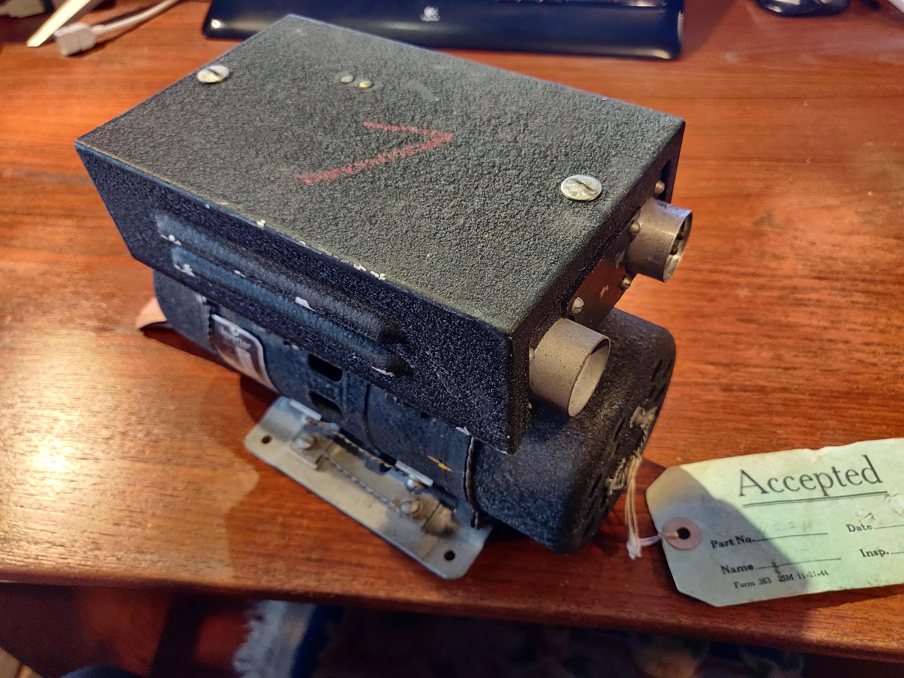
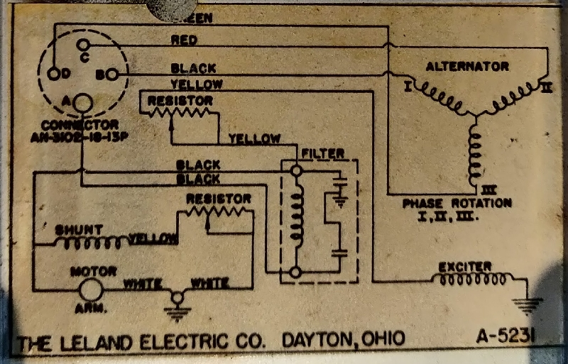
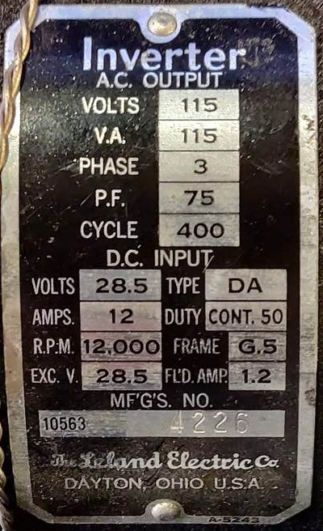

# Aviation_Rotary_Converter
28 VDC to 115 vollt 400 Hz three phase rotary inverter

## Photos

[more images](./images)

[archive images](./images/archive)

## Video

[first run](https://youtu.be/Ptnx6D78xw0)

[load test](https://youtube.com/shorts/2DZrjrXhZ2o)

## Details

* Note
 Schematic is for single plug version, this one has two terminal DC input, negative ground, and 28 V. positive. Output is three phases ground isolated.

